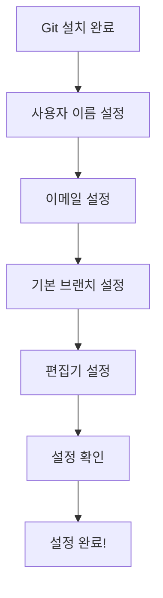

# 🔄 Git 최초 설정 워크플로우

> Git 설치 후 처음 실행해야 하는 설정 과정

---

## 📋 전체 흐름



---

## 단계별 실행

### 📌 Step 1: 사용자 이름 설정

**목적**: 커밋에 기록될 작성자 이름 설정

```bash
git config --global user.name "홍길동"
```

**확인**:
```bash
git config user.name
# 출력: 홍길동
```

---

### 📌 Step 2: 이메일 설정

**목적**: 커밋에 기록될 이메일 (GitHub 계정과 동일 권장)

```bash
git config --global user.email "gildong@gmail.com"
```

**확인**:
```bash
git config user.email
# 출력: gildong@gmail.com
```

---

### 📌 Step 3: 기본 브랜치 설정

**목적**: 새 저장소 생성 시 기본 브랜치 이름 지정

```bash
git config --global init.defaultBranch main
```

> ℹ️ 최신 표준은 `main` 사용 권장

---

### 📌 Step 4: 편집기 설정 (선택)

**목적**: 커밋 메시지 작성 시 사용할 편집기 지정

```bash
# VS Code 사용 시
git config --global core.editor "code --wait"
```

---

### 📌 Step 5: 최종 확인

```bash
git config --list
```

**예상 출력**:
```
user.name=홍길동
user.email=gildong@gmail.com
init.defaultbranch=main
core.editor=code --wait
```

---

## ✅ 체크리스트

- [ ] 사용자 이름 설정 완료
- [ ] 이메일 설정 완료
- [ ] 기본 브랜치 이름 설정 완료
- [ ] 편집기 설정 완료 (선택)
- [ ] 설정 확인 완료

---

## ⚠️ 주의사항

1. `--global` 옵션은 현재 사용자의 모든 프로젝트에 적용
2. 프로젝트별 다른 설정이 필요하면 해당 폴더에서 `--local` 사용
3. 이메일은 GitHub 계정과 동일하게 설정 권장

---

> 📍 **출처**: INTCOL/AI/Git/
