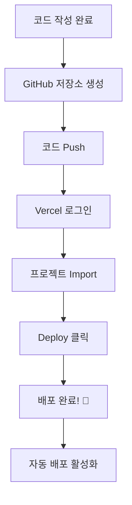

# 🔄 GitHub 연동 배포 워크플로우

> 가장 추천하는 Vercel 배포 방법

---

## 📋 전체 흐름



---

## 단계별 실행

### 📌 Step 1: GitHub 저장소 준비

1. GitHub.com 접속 후 로그인
2. 'New Repository' 클릭
3. 저장소 이름 입력 후 생성

```bash
# 로컬에서 연결
git init
git add .
git commit -m "Initial commit"
git remote add origin https://github.com/[사용자명]/[저장소명].git
git push -u origin main
```

---

### 📌 Step 2: Vercel 로그인

1. [vercel.com](https://vercel.com) 접속
2. **'Continue with GitHub'** 클릭 (가장 편함!)
3. GitHub 권한 승인

---

### 📌 Step 3: 프로젝트 가져오기

1. 대시보드에서 **'Add New...'** 버튼 클릭
2. **'Project'** 선택
3. GitHub 저장소 목록에서 프로젝트 선택
4. **'Import'** 클릭

---

### 📌 Step 4: 설정 및 배포

1. **Project Name**: 자동 입력됨 (변경 가능)
2. **Framework Preset**: 자동 감지됨 (Next.js, React 등)
3. **Build Settings**: 대부분 기본값 OK
4. **Deploy** 버튼 클릭!

---

### 📌 Step 5: 배포 완료 확인

- 폭죽 🎉 애니메이션 = 성공!
- 배포된 URL 확인 (예: `https://your-project.vercel.app`)

---

## ✅ 체크리스트

- [ ] GitHub 저장소 생성 완료
- [ ] 코드 Push 완료
- [ ] Vercel GitHub 로그인 완료
- [ ] 프로젝트 Import 완료
- [ ] Deploy 성공 확인
- [ ] 배포 URL 접속 테스트

---

## 🔄 자동 배포 (이후)

설정 완료 후에는:

1. 코드 수정
2. `git push` 실행
3. **자동으로 재배포!** ✨

> 별도로 버튼을 누를 필요 없습니다.

---

## ⚠️ 주의사항

1. **Hobby 플랜**: 상업적 이용 불가 (광고, 쇼핑몰 등)
2. **환경 변수**: API 키 등은 Vercel 대시보드에서 설정
3. **빌드 실패**: 로그 확인 후 코드 수정 필요

---

## 💡 문제 해결

### 빌드 실패 시
```bash
# 로컬에서 먼저 빌드 테스트
npm run build
```

### 환경 변수 추가
1. Vercel 대시보드 → 프로젝트 선택
2. Settings → Environment Variables
3. 변수 추가 후 **Redeploy**

---

> 📍 **출처**: INTCOL/AI/Vercel/deployment.md
